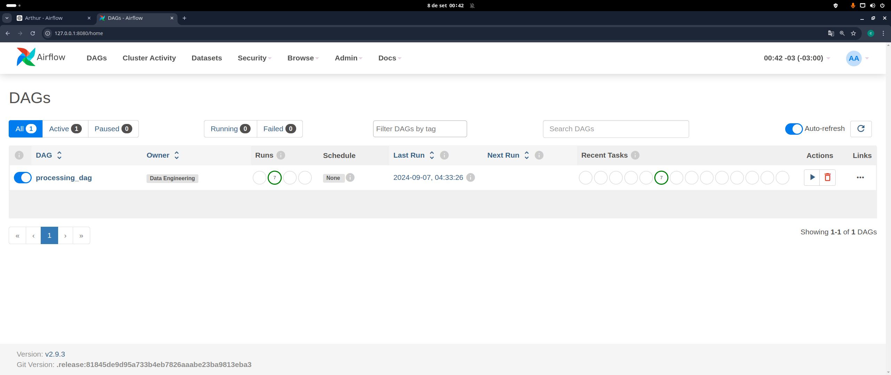
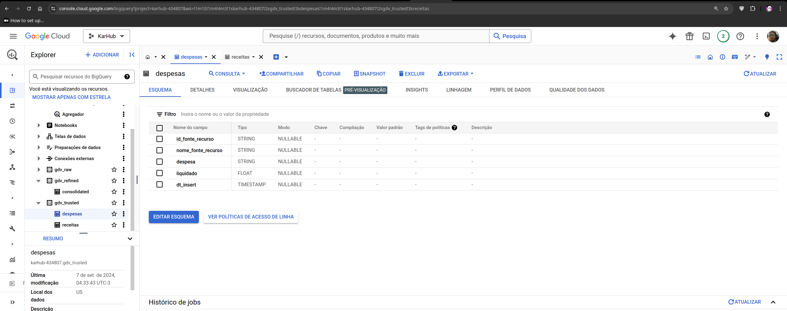
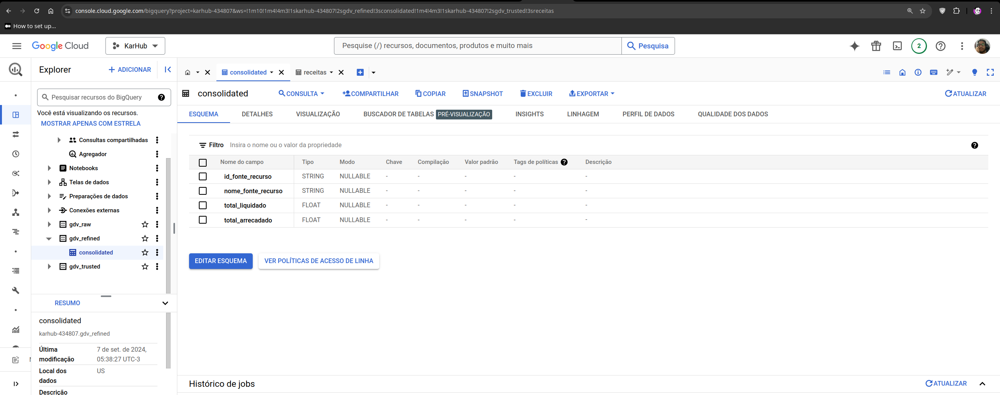

# Desafio KarHub

Esse desafio foi enviado pela KarHub para avaliar a forma como eu arquiteto e crio soluções de ETL.

---

## O Desafio

`O desafio consiste em desenvolver um ETL para processar arquivos que representam o orçamento do Estado de São Paulo de 2022 e armazená-los em um formato consistente para responder perguntas que ajudarão nosso time.`

Mais informações podem ser encontradas no repositório oficial do desafio.

---

## Estrutura do projeto

### Estrutura da aplicação

```shell
.
├── airflow
│   ├── config
│   ├── credentials
│   │   └── karhub-key.json
│   ├── dags
│   │   └── processing_dag.py
│   ├── docker-compose.yaml
│   ├── Dockerfile
│   └── plugins
├── data_engineer_test_v2
│   ├── gdvDespesasExcel.csv
│   ├── gdvReceitasExcel.csv
│   └── README.md
├── notebooks
│   ├── desenvolvimento.ipynb
│   └── exploratory.ipynb
└── README.md
```

### Ferramentas utilizadas

-   Airflow
-   Docker
    -   docker-compose
    -   Imagem customizada (Dockerfile)
-   Google Cloud Platform
    -   Big Query
    -   Cloud Storage
-   API Rest
-   Python
    -   Pendulum
    -   Polars
    -   Pandas

---

### Airflow

-   Arquivos de configuração do airflow
-   Arquivos de docker
-   Dag e Tasks
-   Credencial para uso das ferramentas na GCP



#### Criando o Airflow

Utilizei o `docker-compose` oferecido na documentação do airflow, pode ser obtido utilizando o comando:

```shell
curl -LfO 'https://airflow.apache.org/docs/apache-airflow/2.10.1/docker-compose.yaml'
```

Algumas modificações foram feitas para se adequar ao meu método de desenvolvimento:

-   Não utilizei CeleryExecutor para rodar as tasks, fiz tudo utilizando LocalExecutor.
-   Como não utilizei Celery, pude remover o serviço do Redis do compose original.
-   Apenas uma dag foi criada, no intuito de agrupar as atividades por contexto.
-   Existe uma Task para cada etapa do processo e para cada fonte, ou seja, 1 para cada `.CSV`.
-   As tasks de extração e tratamento foram feitas usando Python, mas a criação da tabela refinada foi feita usando SQL. Não teve motivo específico, só queria fazer essa última etapa usando o BigQuery.

#### O Pipeline 🪁

Dividi o Pipeline em 4 etapas, sendo 1 para extração, 1 para load e 2 para tratamento.


##### Extração

-   Puxamos o dado da memória e colocamos no GCS.

##### Transform

###### Etapa 1

> Zona trusted

-   Aqui foram feitas as transformações de correção de tipo e separação do `identificador` e `nome` da fonte de recurso.
-   Modificação do campo numérico de string para Float
-   Multiplicação do campo de valor pela cotação de fechamento do Dólar do dia 22/06/2022, utilizando a API de referência no documento do desafio.



###### Etapa 2

> Zona refined

-   Aqui foram feitas as agregações para chegar na tabela final especificada no projeto
-   Calculados os totais de cada uma das colunas de valor agregado por fonte



##### Load

O processo de Load é executado em várias etapas.

-   Puxamos o dado do GCS para o Big Query, dataset utilizado foi o gdv_raw.
    -   Adicionamos a coluna de `dt_insert`
    -   Na tabela de despesas tinhamos alguns problemas relacionados a formato e colunas inexistentes.
        -   Nesse caso, já deixei removido a coluna `Unnamed: 3` e removi a última linha dos dois arquivos.
-   Carregamos a etapa 1 e 2 da transformação no BigQuery também
    -   Temos as fontes da tabela `refined` disponíveis para consulta, o que nos ajuda nas perguntas finais do projeto
    -   Como fizemos o load na etapa 1, temos as entidades `despesa` e `receita` bem definidas na camada trusted, o que facilita algumas análises

### data_engineer_test_v2

Submódulo do projeto. Inclui os arquivos de dados e a descrição do projeto.

-   Dados de SP
    -   Despesas
    -   Receitas

### Notebooks

Notebooks utilizados para análise exploratória e desenvolvimento e das funções das Tasks.

---

## Como executar o projeto?

Para executar esse processo, você precisa de uma service-account do meu projeto. Se necessário, pode me chamar. Ela não estará no repositório do projeto.

Para adaptar ao seu projeto, certifique-se de ativar a API do Big Query e de criar os datasets necessários. E certifique-se da sua SA ter acessos de modificação no Storage e no Big Query.

1. Tenha instalado `Docker` e `docker-compose` em sua máquina
2. Vá ao diretório do airflow e execute o `docker-compose up`.
3. Acesse o endereço `127.0.0.1:8080` para acessar o webservice do Airflow
    - O acesso é padrão, login e senha `airflow`
4. Despause a DAG caso esteja pausada e execute.
5. Por fim, poderá utilizar os dados `raw`, `trusted` e `refined` direto no seu BigQuery.

---

## Etapa final: Perguntas a serem respondidas com SQL

1.  Quais são as 5 fontes de recursos que mais arrecadaram?

    ```sql
    select nome_fonte_recurso, total_arrecadado from (
        SELECT
            nome_fonte_recurso,
            ANY_VALUE(total_arrecadado) as total_arrecadado, -- Aqui sabemos que só possui 1 valor, então o any_value é apenas para a agregação
            DENSE_RANK() OVER (ORDER BY SUM(total_arrecadado) DESC ) as rank_arrecadacao, -- poderiamos usar rank(), row_number() ou dense_rank(), depende da regra de negócio. não foi definido regra para empate, então assumi que o dense_rank() pudesse servir.
        FROM `karhub-434807.gdv_refined.consolidated`
        group by nome_fonte_recurso
    )
    where rank_arrecadacao <= 5
    order by rank_arrecadacao
    ```

    O Ranking ficou assim:

    | Nome da Fonte                                |   Total Arrecadado |
    | :------------------------------------------- | -----------------: |
    | TESOURO-DOT.INICIAL E CRED.SUPLEMENTAR       | R$ 755069075741.17 |
    | RECURSOS VINCULADOS ESTADUAIS                | R$ 269273764451.94 |
    | TESOURO-DOT.INICIAL E CRED.SUPLEMENTAR-INTRA | R$ 160756796425.25 |
    | REC.PROPRIO-ADM.IND.-DOT.INIC.CR.SUPL.       |  R$ 56511589734.27 |
    | RECURSOS VINCULADOS FEDERAIS                 |  R$ 44597592235.13 |

2.  Quais são as 5 fontes de recursos que mais gastaram?

    ```sql
    select nome_fonte_recurso, total_liquidado from (
        SELECT
            nome_fonte_recurso,
            ANY_VALUE(total_liquidado) as total_liquidado, -- Aqui sabemos que só possui 1 valor, então o any_value é apenas para a agregação
            DENSE_RANK() OVER (ORDER BY SUM(total_liquidado) DESC ) as rank_liquidacao, -- poderiamos usar rank(), row_number() ou dense_rank(), depende da regra de negócio. não foi definido regra para empate, então assumi que o dense_rank() pudesse servir.
        FROM `karhub-434807.gdv_refined.consolidated`
        group by nome_fonte_recurso
    )
    where rank_liquidacao <= 5
    order by rank_liquidacao
    ```

    O ranking:

    | Nome da Fonte                                | Total Arrecadado   |
    | -------------------------------------------- | ------------------ |
    | TESOURO-DOT.INICIAL E CRED.SUPLEMENTAR       | R$ 761629054293.4  |
    | RECURSOS VINCULADOS ESTADUAIS                | R$ 265605878631.16 |
    | TESOURO-DOT.INICIAL E CRED.SUPLEMENTAR-INTRA | R$ 160672067571.69 |
    | REC.PROPRIO-ADM.IND.-DOT.INIC.CR.SUPL.       | R$ 52974388171.73  |
    | RECURSOS VINCULADOS FEDERAIS                 | R$ 42029087040.35  |

3.  Quais são as 5 fontes de recursos com a melhor margem bruta?

    ```sql
        select nome_fonte_recurso, margem_bruta from (
            SELECT nome_fonte_recurso,
                ANY_VALUE(round(total_arrecadado - total_liquidado, 2)) as margem_bruta , -- Aqui sabemos que só possui 1 valor, então o any_value é apenas para a agregação
                DENSE_RANK() OVER (ORDER BY SUM(total_arrecadado - total_liquidado) DESC ) as rank_margem, -- poderiamos usar rank(), row_number() ou dense_rank(), depende da regra de negócio. não foi definido regra para empate, então assumi que o dense_rank() pudesse servir.
            FROM `karhub-434807.gdv_refined.consolidated`
            group by nome_fonte_recurso
        )
        where rank_margem <= 5
        order by rank_margem
    ```

    | Nome da Fonte                                | Margem Bruta     |
    | -------------------------------------------- | ---------------- |
    | RECURSOS VINCULADOS-FUNDO ESPECIAL DE DESPES | R$ 5607091048.65 |
    | OP.CRED.E CONTRIB.DO EXTERIOR-DOT.INIC.CR.SU | R$ 4513392886.48 |
    | RECURSOS VINCULADOS ESTADUAIS                | R$ 3667885820.78 |
    | REC.PROPRIO-ADM.IND.-DOT.INIC.CR.SUPL.       | R$ 3537201562.54 |
    | RECURSOS VINCULADOS FEDERAIS                 | R$ 2568505194.78 |

4.  Quais são as 5 fontes de recursos que ~~menir~~ menos arrecadaram?

    ```sql
    select nome_fonte_recurso, total_arrecadado from (
        SELECT
            nome_fonte_recurso,
            ANY_VALUE(total_arrecadado) as total_arrecadado, -- Aqui sabemos que só possui 1 valor, então o any_value é apenas para a agregação
            DENSE_RANK() OVER (ORDER BY SUM(total_arrecadado) ASC ) as rank_arrecadacao, -- poderiamos usar rank(), row_number() ou dense_rank(), depende da regra de negócio. não foi definido regra para empate, então assumi que o dense_rank() pudesse servir.
        FROM `karhub-434807.gdv_refined.consolidated`
        group by nome_fonte_recurso
    )
    where rank_arrecadacao <= 5
    order by rank_arrecadacao
    ```

    | Nome da Fonte                                | Margem Bruta |
    | -------------------------------------------- | ------------ |
    | F.E.D - CREDITO POR SUPERAVIT FINANCEIRO     | R$ 0.0       |
    | TESOURO - CREDITO POR SUPERAVIT FINANCEIRO   | R$ 0.05      |
    | REC.VINC.TRANSF.FEDERAL/SUPERAVIT FINANC.    | R$ 678.56    |
    | REC.VINC.ESTADUAIS-CRED.SUPERAVIT FINANCEIRO | R$ 27811.77  |
    | REC.PROP.ADM.IND-CRED.P/SUPERVAVIT FINANCEIR | R$ 2991329.7 |

5.  Quais são as 5 fontes de recursos que ~~menir~~ menos gastaram?

    ```sql
        SELECT nome_fonte_recurso, total_liquidado FROM (
            SELECT
                nome_fonte_recurso,
                ANY_VALUE(total_liquidado) as total_liquidado, -- Aqui sabemos que só possui 1 valor, então o any_value é apenas para a agregação
                DENSE_RANK() OVER (ORDER BY SUM(total_liquidado) ASC ) AS rank_liquidacao, -- poderiamos usar rank(), row_number() ou dense_rank(), depende da regra de negócio. não foi definido regra para empate, então assumi que o dense_rank() pudesse servir.
            FROM `karhub-434807.gdv_refined.consolidated`
            group by nome_fonte_recurso
        )
        where rank_liquidacao <= 5
        order by rank_liquidacao
    ```

    O ranking:

    | Nome da Fonte                                | Total Arrecadado |
    | -------------------------------------------- | ---------------- |
    | REC.PROPRIO-ADM.IND.-DOT.INIC.CR.SUPL.-INTRA | R$ 14250558.32   |
    | F.E.D - CREDITO POR SUPERAVIT FINANCEIRO     | R$ 161756266.19  |
    | OP.CRED.CONTR.EXTERIOR-DOT.INIC.CR.SUP-INTRA | R$ 241240537.08  |
    | RECURSOS VINCULADOS-FUNDO ESP. DESPESA-INTRA | R$ 244121178.21  |
    | OUTRAS FONTES DE RECURSOS-INTRA              | R$ 713605495.45  |

6.  Quais são as 5 fontes de recursos com a pior margem bruta?

    ```sql
    select nome_fonte_recurso, margem_bruta from (
        SELECT nome_fonte_recurso,
            ANY_VALUE(round(total_arrecadado - total_liquidado, 2)) as margem_bruta , -- Aqui sabemos que só possui 1 valor, então o any_value é apenas para a agregação
            DENSE_RANK() OVER (ORDER BY SUM(total_arrecadado - total_liquidado) ASC ) as rank_margem, -- poderiamos usar rank(), row_number() ou dense_rank(), depende da regra de negócio. não foi definido regra para empate, então assumi que o dense_rank() pudesse servir.
        FROM `karhub-434807.gdv_refined.consolidated`
        group by nome_fonte_recurso
    )
    where rank_margem <= 5
    order by rank_margem
    ```

    | nome_fonte_recurso                           | margem_bruta   |
    | -------------------------------------------- | -------------- |
    | TESOURO - CREDITO POR SUPERAVIT FINANCEIRO   | -7362312397.45 |
    | TESOURO-DOT.INICIAL E CRED.SUPLEMENTAR       | -6559978552.23 |
    | REC.OPERAC. DE CREDITO-P/SUPERAVIT FINANCEIR | -4391123771.66 |
    | REC.VINC.ESTADUAIS-CRED.SUPERAVIT FINANCEIRO | -2723946527.98 |
    | REC.PROP.ADM.IND-CRED.P/SUPERVAVIT FINANCEIR | -2449176439.31 |

    Aqui nesse caso, temos uma margem negativa, significa que essas fontes liquidaram mais do que arrecadaram.

7.  Qual a média de arrecadação por fonte de recurso?

    ```sql
    SELECT
        nome_fonte_recurso,
        round(avg(arrecadado), 2) as media_arrecadacao
    FROM `karhub-434807.gdv_trusted.receitas`
    group by nome_fonte_recurso
    order by media_arrecadacao desc
    ```

    | nome_fonte_recurso                           | media_arrecadacao |
    | -------------------------------------------- | ----------------: |
    | TESOURO-DOT.INICIAL E CRED.SUPLEMENTAR       | R$ 13483376352.52 |
    | TESOURO-DOT.INICIAL E CRED.SUPLEMENTAR-INTRA |  R$ 8930933134.74 |
    | RECURSOS VINCULADOS ESTADUAIS                |  R$ 7277669309.51 |
    | RECURSOS VINCULADOS FEDERAIS                 |  R$ 1651762675.38 |
    | OP.CRED.E CONTRIB.DO EXTERIOR-DOT.INIC.CR.SU |  R$ 1237622451.31 |
    | OUTRAS FONTES DE RECURSOS                    |  R$ 1134158327.04 |
    | RECURSOS VINCULADOS ESTADUAIS-INTRA          |  R$ 1054925779.26 |
    | REC.PROPRIO-ADM.IND.-DOT.INIC.CR.SUPL.       |  R$ 1009135530.97 |
    | RECURSOS VINCULADOS-FUNDO ESPECIAL DE DESPES |   R$ 725044171.07 |
    | OUTRAS FONTES DE RECURSOS-INTRA              |   R$ 713605495.45 |
    | RECURSOS VINCULADOS FEDERAIS-INTRA           |   R$ 293235292.05 |
    | OP.CRED.CONTR.EXTERIOR-DOT.INIC.CR.SUP-INTRA |   R$ 241240537.09 |
    | RECURSOS VINCULADOS-FUNDO ESP. DESPESA-INTRA |     R$ 82666985.5 |
    | REC.OPERAC. DE CREDITO-P/SUPERAVIT FINANCEIR |    R$ 61842168.09 |
    | REC.PROPRIO-ADM.IND.-DOT.INIC.CR.SUPL.-INTRA |     R$ 7577554.98 |
    | REC.PROP.ADM.IND-CRED.P/SUPERVAVIT FINANCEIR |      R$ 598265.94 |
    | REC.VINC.ESTADUAIS-CRED.SUPERAVIT FINANCEIRO |        R$ 6952.94 |
    | REC.VINC.TRANSF.FEDERAL/SUPERAVIT FINANC.    |         R$ 169.64 |
    | TESOURO - CREDITO POR SUPERAVIT FINANCEIRO   |           R$ 0.02 |
    | F.E.D - CREDITO POR SUPERAVIT FINANCEIRO     |            R$ 0.0 |
    | EXTRA ORCAMENTARIA                           |            R$ 0.0 |

8.  Qual a média de gastos por fonte de recurso?

    ```sql
    SELECT
        nome_fonte_recurso,
        round(avg(liquidado), 2) as media_liquidacao
    FROM `karhub-434807.gdv_trusted.despesas`
    group by nome_fonte_recurso
    order by media_liquidacao desc
    ```

    | nome_fonte_recurso                           | media_liquidacao |
    | -------------------------------------------- | ---------------: |
    | TESOURO-DOT.INICIAL E CRED.SUPLEMENTAR       | R$ 1889898397.75 |
    | RECURSOS VINCULADOS ESTADUAIS                |  R$ 1509124310.4 |
    | TESOURO-DOT.INICIAL E CRED.SUPLEMENTAR-INTRA |  R$ 918126100.41 |
    | RECURSOS VINCULADOS ESTADUAIS-INTRA          |  R$ 703283852.84 |
    | OUTRAS FONTES DE RECURSOS-INTRA              |  R$ 237868498.48 |
    | OP.CRED.E CONTRIB.DO EXTERIOR-DOT.INIC.CR.SU |  R$ 231259753.72 |
    | RECURSOS VINCULADOS FEDERAIS                 |  R$ 205019936.78 |
    | REC.PROPRIO-ADM.IND.-DOT.INIC.CR.SUPL.       |  R$ 199151835.23 |
    | TESOURO - CREDITO POR SUPERAVIT FINANCEIRO   |  R$ 171216567.38 |
    | REC.OPERAC. DE CREDITO-P/SUPERAVIT FINANCEIR |  R$ 144952888.88 |
    | OUTRAS FONTES DE RECURSOS                    |  R$ 110242380.55 |
    | RECURSOS VINCULADOS-FUNDO ESPECIAL DE DESPES |  R$ 106430195.41 |
    | REC.VINC.ESTADUAIS-CRED.SUPERAVIT FINANCEIRO |   R$ 56749465.41 |
    | OP.CRED.CONTR.EXTERIOR-DOT.INIC.CR.SUP-INTRA |   R$ 40206756.18 |
    | RECURSOS VINCULADOS FEDERAIS-INTRA           |   R$ 39098038.94 |
    | REC.VINC.TRANSF.FEDERAL/SUPERAVIT FINANC.    |   R$ 18619029.31 |
    | REC.PROP.ADM.IND-CRED.P/SUPERVAVIT FINANCEIR |    R$ 18164205.7 |
    | RECURSOS VINCULADOS-FUNDO ESP. DESPESA-INTRA |    R$ 6781143.84 |
    | F.E.D - CREDITO POR SUPERAVIT FINANCEIRO     |    R$ 2021953.33 |
    | REC.PROPRIO-ADM.IND.-DOT.INIC.CR.SUPL.-INTRA |      R$ 548098.4 |

## Dificuldades do projeto

-   Eu tive a sorte de ter 4 dias restantes pra fazer uso dos créditos gratuitos do GCP
-   Tive uns problemas com o service do Redis, então tive que usar o LocalExecutor
-   Não consegui utilizar variáveis de ambiente, então todas as variáveis foram hard coded

## Como o projeto poderia ser melhorado?

Em caso do projeto escalar, poderíamos:

-   Utilizar data-quality (great-expectations ou soda) para garantir a qualidade e conformidade dos dados em todas as etapas
-   Utilizar ferramentas para documentação e catalogação (Datahub :heart:)
-   Utilizar PythonOperators para executar códigos de python no Airflow
    -   Aqui seria uma melhoria válida para esse projeto, mas por questões de complexidade, não abordei
-   Utilizar ferramentas como Data Proc para fazer os processamentos dos dados em um ambiente descentralizado

Mas, para fins de estudo e demonstração, esse projeto tá bem completinho e cumpre exatamente o que ele precisa.

## That's all, folks! :heart:
